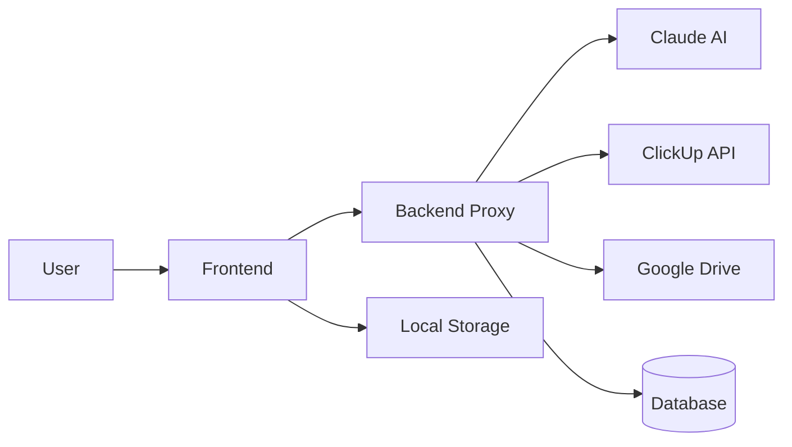

# 56k Knowledge Hub - Documentazione Completa (Legacy)

> Questa versione monolitica è stata sostituita da documentazione modulare nella cartella `docs/`. Rimane per retro‑compatibilità storica; nuovi aggiornamenti avverranno nei file segmentati.

## 📋 Indice
1. [Overview](#overview)
2. [Requisiti di Sistema](#requisiti-di-sistema)
3. [Guida all'Installazione](#guida-allinstallazione)
4. [Configurazione API e Servizi](#configurazione-api-e-servizi)
5. [Architettura Tecnica](#architettura-tecnica)
6. [Guida Utente](#guida-utente)
7. [Troubleshooting](#troubleshooting)
8. [API Reference](#api-reference)

---

## 🎯 Overview

**56k Knowledge Hub** è un assistente AI intelligente che unifica l'accesso a ClickUp e Google Drive, permettendo di interrogare progetti, task e documenti attraverso l'intelligenza di Claude AI (Anthropic).

### Funzionalità Principali
- ✅ Integrazione completa con ClickUp per gestione task e progetti
- 📁 Accesso a Google Drive per documenti aziendali
- 🤖 AI powered by Claude 3.5 Sonnet
- 💾 Salvataggio conversazioni con supporto database
- 📊 Analytics e insights cross-platform
- 🔐 Autenticazione Google Workspace
- 📝 Logging completo per debug

### Benefici
- **Risparmio tempo**: -70% nel recupero informazioni
- **Visione unificata**: Tutti i dati in un'unica interfaccia
- **Insights intelligenti**: Analisi impossibili con tool separati
- **Scalabilità**: Architettura modulare e estendibile

---

## 💻 Requisiti di Sistema

### Client (Browser)
- Chrome 90+, Firefox 88+, Safari 14+, Edge 90+
- JavaScript abilitato
- Connessione internet stabile

### Server (Opzionale per funzionalità avanzate)
- Node.js 18+ o Python 3.9+
- 2GB RAM minimo
- 10GB spazio disco
- SSL certificate per produzione

### Database (Opzionale)
- SQLite (incluso) per uso locale
- MySQL 8.0+ per team piccoli
- PostgreSQL 13+ per scalabilità
- Supabase per cloud hosting

---

## 🚀 Guida all'Installazione

### Step 1: Setup Iniziale

#### 1.1 Download e Deploy Base

```bash
# Clone o scarica i file
git clone https://github.com/your-org/56k-knowledge-hub.git
cd 56k-knowledge-hub

# Per uso locale semplice
# Apri index.html nel browser

# Per deploy su server
npm install
npm run build
npm start
```

#### 1.2 Configurazione HTTPS (Produzione)

```nginx
server {
    listen 443 ssl;
    server_name hub.56k.agency;
    
    ssl_certificate /path/to/cert.pem;
    ssl_certificate_key /path/to/key.pem;
    
    location / {
        proxy_pass http://localhost:3000;
        proxy_http_version 1.1;
        proxy_set_header Upgrade $http_upgrade;
        proxy_set_header Connection 'upgrade';
    }
}
```

### Step 2: Google Workspace Setup

#### 2.1 Creazione Progetto Google Cloud

1. Vai su [Google Cloud Console](https://console.cloud.google.com)
2. Crea nuovo progetto: "56k Knowledge Hub"
3. Abilita le API necessarie:
   ```
   - Google Drive API
   - Google Docs API
   - Google Sheets API
   - Google OAuth2 API
   ```

#### 2.2 Configurazione OAuth2

1. **Credenziali OAuth**
   - Vai in "APIs & Services" → "Credentials"
   - Crea "OAuth 2.0 Client ID"
   - Tipo: Web application
   - Authorized redirect URIs:
     ```
     http://localhost:3000/callback (dev)
     https://hub.56k.agency/callback (prod)
     ```

2. **Consent Screen**
   - User Type: Internal (per G Workspace)
   - Scopes richiesti:
     ```
     https://www.googleapis.com/auth/drive.readonly
     https://www.googleapis.com/auth/documents.readonly
     https://www.googleapis.com/auth/userinfo.email
     https://www.googleapis.com/auth/userinfo.profile
     ```

3. **Salva le credenziali**:
   ```
   Client ID: xxxxx.apps.googleusercontent.com
   Client Secret: GOCSPX-xxxxxxxxxxxxx
   ```

### Step 3: Claude AI (Anthropic) Setup

#### 3.1 Ottenere API Key

1. Registrati su [console.anthropic.com](https://console.anthropic.com)
2. Crea nuovo progetto
3. Genera API key
4. Imposta limiti di spesa mensili

#### 3.2 Best Practices API Key
```javascript
// NON fare mai questo:
const API_KEY = "sk-ant-api03-xxxxx"; // ❌ Esposta nel codice

// Usa invece:
// 1. Variabili d'ambiente (backend)
process.env.CLAUDE_API_KEY

// 2. Secure storage (frontend)
// Configurazione tramite UI settings
```

### Step 4: ClickUp Integration

#### 4.1 Generare API Token

1. Login su ClickUp
2. Settings → Apps → API Token
3. Genera Personal Token
4. Copia il token: `pk_xxxxx_xxxxx`

#### 4.2 Ottenere Team ID

```bash
# Con curl
curl -X GET https://api.clickup.com/api/v2/team \
  -H "Authorization: pk_YOUR_TOKEN"

# Response
{
  "teams": [{
    "id": "1234567",  # <-- Questo è il Team ID
    "name": "56k Agency"
  }]
}
```

### Step 5: Database Setup (Opzionale)

#### 5.1 SQLite (Default - Locale)
```javascript
// Automatico, nessuna config necessaria
// File creato in: ./data/conversations.db
```

#### 5.2 MySQL
```sql
CREATE DATABASE knowledge_hub;
CREATE USER 'hub_user'@'localhost' IDENTIFIED BY 'secure_password';
GRANT ALL PRIVILEGES ON knowledge_hub.* TO 'hub_user'@'localhost';
FLUSH PRIVILEGES;

-- Schema automatico all'avvio
```

#### 5.3 PostgreSQL
```sql
CREATE DATABASE knowledge_hub;
CREATE USER hub_user WITH ENCRYPTED PASSWORD 'secure_password';
GRANT ALL PRIVILEGES ON DATABASE knowledge_hub TO hub_user;

-- Schema automatico all'avvio
```

#### 5.4 Supabase
1. Crea progetto su [supabase.com](https://supabase.com)
2. Copia URL e Anon Key dal dashboard
3. Configura nelle impostazioni dell'app

### Step 6: Backend Server (Opzionale ma Consigliato)

#### 6.1 Node.js Backend

```javascript
// server.js
const express = require('express');
const cors = require('cors');
require('dotenv').config();

const app = express();
app.use(cors());
app.use(express.json());

// Proxy sicuro per API keys
app.post('/api/claude', async (req, res) => {
    const response = await fetch('https://api.anthropic.com/v1/messages', {
        method: 'POST',
        headers: {
            'x-api-key': process.env.CLAUDE_API_KEY,
            'Content-Type': 'application/json'
        },
        body: JSON.stringify(req.body)
    });
    res.json(await response.json());
});

// ClickUp proxy
app.get('/api/clickup/*', async (req, res) => {
    const response = await fetch(`https://api.clickup.com/api/v2/${req.params[0]}`, {
        headers: {
            'Authorization': process.env.CLICKUP_TOKEN
        }
    });
    res.json(await response.json());
});

app.listen(3000, () => {
    console.log('Backend running on port 3000');
});
```

#### 6.2 Environment Variables (.env)
```bash
# API Keys (MAI nel codice frontend!)
CLAUDE_API_KEY=sk-ant-api03-xxxxx
CLICKUP_TOKEN=pk_xxxxx_xxxxx
CLICKUP_TEAM_ID=1234567

# Google OAuth
GOOGLE_CLIENT_ID=xxxxx.apps.googleusercontent.com
GOOGLE_CLIENT_SECRET=GOCSPX-xxxxx

# Database
DB_TYPE=postgresql
DB_HOST=localhost
DB_PORT=5432
DB_NAME=knowledge_hub
DB_USER=hub_user
DB_PASS=secure_password

# Logging
LOG_LEVEL=info
LOG_PATH=./logs
LOG_RETENTION_DAYS=30

# Cache
REDIS_URL=redis://localhost:6379
CACHE_TTL=3600
```

---

## ⚙️ Configurazione API e Servizi

### Pannello Configurazione In-App

L'applicazione include un pannello di configurazione completo accessibile tramite l'icona ⚙️:

#### Tab 1: API Keys
- **Claude API Key**: Token di Anthropic
- **ClickUp Token**: Personal access token
- **ClickUp Team ID**: ID workspace
- **Google OAuth**: Client ID e Secret

#### Tab 2: Database
- **Tipo**: none, sqlite, mysql, postgresql, supabase
- **Connessione**: Host, porta, credenziali
- **Test Connection**: Verifica configurazione

#### Tab 3: Logging
- **Livello**: error, warning, info, debug
- **Path**: Directory dei log
- **Retention**: Giorni di conservazione
- **Console**: Output nel browser

#### Tab 4: Avanzate
- **Backend URL**: Server proxy per API
- **Max Tokens**: Lunghezza risposte AI
- **Temperature**: Creatività AI (0-1)
- **Cache TTL**: Durata cache
- **Rate Limit**: Limite richieste/minuto

---

## 🏗️ Architettura Tecnica

### Stack Tecnologico

```
Frontend:
├── HTML5 + CSS3 (no framework richiesto)
├── Vanilla JavaScript ES6+
├── Local Storage per config
└── Service Worker (opzionale per offline)

Backend (Opzionale):
├── Node.js / Express.js
├── API Proxy Layer
├── Session Management
└── Cache Layer (Redis)

Database:
├── SQLite (embedded)
├── MySQL/PostgreSQL (team)
└── Supabase (cloud)
└── Schema auto-migration

Integrazioni:
├── Claude API (Anthropic)
├── ClickUp API v2
├── Google Drive API v3
└── OAuth2 Flow
```

### Flusso Dati



### Struttura File

```
56k-knowledge-hub/
├── index.html              # App principale
├── server.js              # Backend Node.js
├── package.json           # Dependencies
├── .env.example          # Template configurazione
├── /logs                 # Directory log
├── /data                # Database SQLite
└── /docs               # Documentazione
```

### Sicurezza

#### Best Practices Implementate
1. **API Keys mai nel frontend** - Sempre tramite backend proxy
2. **OAuth2 per Google** - No password storing
3. **HTTPS obbligatorio** in produzione
4. **Rate limiting** per prevenire abusi
5. **Input sanitization** contro XSS
6. **CORS configurato** correttamente
7. **Logging** di tutti gli accessi

#### Headers di Sicurezza (nginx/apache)
```
Content-Security-Policy: default-src 'self'
X-Frame-Options: DENY
X-Content-Type-Options: nosniff
Referrer-Policy: no-referrer
```

---

## 📖 Guida Utente

### Primo Accesso

1. **Login Google Workspace**
   - Clicca "Accedi con Google"
   - Autorizza accesso (solo account @56k.agency)
   - Permetti accesso Drive (read-only)

2. **Configurazione Iniziale**
   - Clicca ⚙️ Impostazioni
   - Inserisci API keys
   - Configura database (opzionale)
   - Salva configurazione

### Utilizzo Base

#### Avviare una Conversazione

**Metodo 1: Feature Cards**
- Clicca su una card (ClickUp, Drive, Analysis, Insights)
- L'AI inizierà con domande guidate

**Metodo 2: Query Diretta**
- Scrivi nel campo di input
- Premi Invio o clicca Invia

**Metodo 3: Suggested Queries**
- Usa i chip dinamici che appaiono
- Si aggiornano in base ai tuoi dati reali

#### Esempi di Query

**Task Management:**
```
"Quali task sono in scadenza questa settimana?"
"Mostrami il workload di Marco"
"Status del progetto Website Redesign"
"Task non assegnate con priorità alta"
```

**Documenti:**
```
"Trova il contratto del cliente ABC"
"Documenti modificati oggi"
"Presentazioni del Q3"
"Budget analysis più recente"
```

**Analytics Cross-Platform:**
```
"Confronta ore trackate vs budget progetto X"
"ROI dei progetti completati questo mese"
"Documenti collegati alle task in ritardo"
"Report settimanale per il cliente Y"
```

### Funzionalità Avanzate

#### Conversazioni Salvate
- Configurare un database nelle impostazioni
- Le chat vengono salvate automaticamente
- Accedi dalla sidebar laterale
- Ricerca nelle conversazioni passate

#### Export e Report
- Copia risposte con formattazione
- Genera report PDF (tramite browser print)
- Export conversazioni in JSON

#### Shortcuts Keyboard
- `Enter` - Invia messaggio
- `Shift+Enter` - Nuova riga
- `Ctrl+K` - Focus su input
- `Ctrl+L` - Clear chat
- `Esc` - Chiudi modal

---

## 🔧 Troubleshooting

### Problemi Comuni e Soluzioni

#### 1. "Claude API error: 401"
**Causa**: API key non valida o scaduta
**Soluzione**: 
- Verifica API key in settings
- Controlla scadenza su console.anthropic.com
- Rigenera se necessario

#### 2. "Cannot access Google Drive"
**Causa**: Token OAuth scaduto o permessi insufficienti
**Soluzione**:
- Logout e login di nuovo
- Verifica scopes in Google Cloud Console
- Controlla che l'utente sia nel dominio autorizzato

#### 3. "ClickUp data not loading"
**Causa**: Token non valido o Team ID errato
**Soluzione**:
```bash
# Test token
curl -H "Authorization: YOUR_TOKEN" \
  https://api.clickup.com/api/v2/team

# Se funziona, verifica Team ID nella response
```

#### 4. "Database connection failed"
**Causa**: Credenziali errate o server non raggiungibile
**Soluzione**:
- Test connessione manuale
- Verifica firewall/network
- Check permessi utente database

#### 5. "Risposte AI troppo lente"
**Causa**: Rate limiting o latenza di rete
**Soluzione**:
- Riduci max_tokens nelle impostazioni
- Abilita caching
- Usa backend proxy locale

### Log Analysis

#### Abilitare Debug Logging
1. Settings → Logging → Level: Debug
2. Apri Console Browser (F12)
3. Riproduci il problema
4. Copia i log per supporto

#### Log Files Location
```
Windows: C:\Users\[User]\AppData\Local\56k-hub\logs
Mac: ~/Library/Logs/56k-hub/
Linux: ~/.local/share/56k-hub/logs/
```

#### Formato Log
```json
{
  "timestamp": "2024-01-15T10:30:00Z",
  "level": "error",
  "message": "API call failed",
  "data": {
    "endpoint": "clickup",
    "status": 403,
    "error": "Forbidden"
  }
}
```

---

## 📚 API Reference

### Claude API Integration

#### Request Format
```javascript
POST /api/claude
{
  "model": "claude-3-5-sonnet-20241022",
  "max_tokens": 2000,
  "temperature": 0.7,
  "messages": [{
    "role": "user",
    "content": "Query with context"
  }]
}
```

#### Response Format
```javascript
{
  "content": [{
    "type": "text",
    "text": "AI response with HTML formatting"
  }],
  "usage": {
    "input_tokens": 150,
    "output_tokens": 500
  }
}
```

### ClickUp API Endpoints Used

```javascript
// Get Tasks
GET /team/{team_id}/task
Query: ?statuses[]=open&assignees[]=123

// Get Projects  
GET /team/{team_id}/space

// Get Time Tracking
GET /team/{team_id}/time_entries

// Get Custom Fields
GET /list/{list_id}/field
```

### Google Drive API Methods

```javascript
// Search Files
GET /drive/v3/files
Query: ?q=name contains 'budget' and modifiedTime > '2024-01-01'

// Get File Content
GET /drive/v3/files/{fileId}?alt=media

// List Shared Drives
GET /drive/v3/drives

// Get File Metadata
GET /drive/v3/files/{fileId}?fields=*
```

### Database Schema

#### Conversations Table
```sql
CREATE TABLE conversations (
    id VARCHAR(36) PRIMARY KEY,
    user_id VARCHAR(255) NOT NULL,
    title VARCHAR(255),
    created_at TIMESTAMP DEFAULT CURRENT_TIMESTAMP,
    updated_at TIMESTAMP DEFAULT CURRENT_TIMESTAMP ON UPDATE CURRENT_TIMESTAMP,
    INDEX idx_user_id (user_id),
    INDEX idx_created_at (created_at)
);
```

#### Messages Table
```sql
CREATE TABLE messages (
    id VARCHAR(36) PRIMARY KEY,
    conversation_id VARCHAR(36) NOT NULL,
    role ENUM('user', 'assistant') NOT NULL,
    content TEXT NOT NULL,
    created_at TIMESTAMP DEFAULT CURRENT_TIMESTAMP,
    FOREIGN KEY (conversation_id) REFERENCES conversations(id) ON DELETE CASCADE,
    INDEX idx_conversation_id (conversation_id)
);
```

#### Settings Table
```sql
CREATE TABLE user_settings (
    user_id VARCHAR(255) PRIMARY KEY,
    settings JSON,
    updated_at TIMESTAMP DEFAULT CURRENT_TIMESTAMP ON UPDATE CURRENT_TIMESTAMP
);
```

---

## 🚀 Deployment

### Deployment su Vercel

```bash
# 1. Installa Vercel CLI
npm i -g vercel

# 2. Deploy
vercel --prod

# 3. Configura environment variables nel dashboard Vercel
```

### Deployment su Docker

```dockerfile
# Dockerfile
FROM node:18-alpine
WORKDIR /app
COPY package*.json ./
RUN npm ci --only=production
COPY . .
EXPOSE 3000
CMD ["node", "server.js"]
```

```bash
# Build e run
docker build -t 56k-hub .
docker run -p 3000:3000 --env-file .env 56k-hub
```

### Deployment su Cloud Providers

#### AWS EC2
```bash
# Setup instance
sudo apt update
sudo apt install nodejs npm nginx
git clone [repo]
cd 56k-knowledge-hub
npm install
pm2 start server.js
```

#### Google Cloud Run
```bash
gcloud run deploy 56k-hub \
  --image gcr.io/project/56k-hub \
  --platform managed \
  --region europe-west1 \
  --allow-unauthenticated
```

#### Azure App Service
```bash
az webapp create \
  --resource-group 56k-rg \
  --plan 56k-plan \
  --name 56k-hub \
  --runtime "NODE|18-lts"
```

---

## 📊 Monitoring e Maintenance

### Health Checks

```javascript
// Endpoint health check
GET /health
Response: {
  "status": "healthy",
  "services": {
    "claude": "connected",
    "clickup": "connected",
    "drive": "connected",
    "database": "connected"
  },
  "uptime": 86400,
  "version": "1.0.0"
}
```

### Metriche da Monitorare

1. **Performance**
   - Response time API calls
   - Token usage (Claude)
   - Cache hit rate
   - Database query time

2. **Errors**
   - API failures per service
   - Authentication errors
   - Rate limit hits
   - Database connection errors

3. **Usage**
   - Active users daily/monthly
   - Queries per user
   - Most used features
   - Storage utilizzato

### Backup Strategy

```bash
# Backup giornaliero database
0 2 * * * mysqldump knowledge_hub > backup_$(date +\%Y\%m\%d).sql

# Backup settings e logs
0 3 * * * tar -czf logs_$(date +\%Y\%m\%d).tar.gz ./logs

# Sync su cloud storage
0 4 * * * aws s3 sync ./backups s3://56k-backups/
```

### Update Procedure

1. **Test in Staging**
   ```bash
   git checkout staging
   git merge feature/new-feature
   npm test
   ```

2. **Backup Production**
   ```bash
   ./scripts/backup.sh
   ```

3. **Deploy con Zero Downtime**
   ```bash
   pm2 reload ecosystem.config.js
   ```

4. **Verify**
   ```bash
   curl https://hub.56k.agency/health
   ```

---

## 🔐 Security Checklist

### Pre-Production Checklist

- [ ] **API Keys**
  - [ ] Tutte le keys nel backend, mai nel frontend
  - [ ] Rotation schedule configurato
  - [ ] Limiti di spesa impostati

- [ ] **Authentication**
  - [ ] Solo domini autorizzati (@56k.agency)
  - [ ] Session timeout configurato
  - [ ] Multi-factor authentication (opzionale)

- [ ] **Network**
  - [ ] HTTPS enforced
  - [ ] CORS configurato correttamente
  - [ ] Rate limiting attivo
  - [ ] Firewall rules

- [ ] **Data**
  - [ ] Encryption at rest (database)
  - [ ] Encryption in transit (HTTPS)
  - [ ] Backup automatici
  - [ ] GDPR compliance

- [ ] **Monitoring**
  - [ ] Alerting configurato
  - [ ] Log aggregation
  - [ ] Error tracking
  - [ ] Uptime monitoring

---

## 📈 Performance Optimization

### Frontend Optimization

```javascript
// 1. Lazy loading per conversazioni
const loadConversation = async (id) => {
    const conv = await import(`./conversations/${id}.js`);
    return conv.default;
};

// 2. Debouncing per input
let timeout;
const debouncedSearch = (query) => {
    clearTimeout(timeout);
    timeout = setTimeout(() => search(query), 500);
};

// 3. Virtual scrolling per lunghe liste
// Implementa con libreria come virtual-scroller
```

### Backend Optimization

```javascript
// 1. Caching con Redis
const cached = await redis.get(cacheKey);
if (cached) return JSON.parse(cached);

// 2. Connection pooling database
const pool = mysql.createPool({
    connectionLimit: 10,
    host: 'localhost',
    user: 'root',
    password: 'password',
    database: 'knowledge_hub'
});

// 3. Compression
app.use(compression());
```

### API Optimization

```javascript
// 1. Batch requests
const batchRequests = async (requests) => {
    return Promise.all(requests.map(r => 
        fetch(r.url, r.options)
    ));
};

// 2. Partial responses
GET /api/tasks?fields=id,name,status

// 3. Pagination
GET /api/files?page=1&limit=50
```

---

## 🤝 Support e Contatti

### Risorse Utili

- **Documentazione Claude**: [docs.anthropic.com](https://docs.anthropic.com)
- **ClickUp API Docs**: [clickup.com/api](https://clickup.com/api)
- **Google Drive API**: [developers.google.com/drive](https://developers.google.com/drive)

### Community e Support

- **GitHub Issues**: Per bug e feature requests
- **Discord**: Community chat per supporto
- **Email Support**: support@56k.agency
- **Knowledge Base**: kb.56k.agency

### Contribuire

1. Fork del repository
2. Crea feature branch (`git checkout -b feature/AmazingFeature`)
3. Commit changes (`git commit -m 'Add AmazingFeature'`)
4. Push to branch (`git push origin feature/AmazingFeature`)
5. Open Pull Request

### Licenza

```
MIT License

Copyright (c) 2024 56k Agency

Permission is hereby granted, free of charge, to any person obtaining a copy
of this software and associated documentation files (the "Software"), to deal
in the Software without restriction...
```

---

## 📝 Changelog

### Version 1.0.0 (Current)
- ✅ Initial release
- ✅ Claude Sonnet integration
- ✅ ClickUp API support
- ✅ Google Drive integration
- ✅ Database support
- ✅ Settings UI
- ✅ Conversation history
- ✅ Dynamic queries

### Roadmap v1.1.0
- 🔄 Slack integration
- 🔄 Notion support
- 🔄 Advanced analytics dashboard
- 🔄 Voice input/output
- 🔄 Mobile app
- 🔄 Webhooks support
- 🔄 Custom AI prompts
- 🔄 Export to PDF/Excel

---

## 🎯 Best Practices

### Per l'Utilizzo Quotidiano

1. **Query Efficaci**
   - Sii specifico nelle domande
   - Usa nomi di progetti/persone esatti
   - Specifica timeframe quando rilevante

2. **Organizzazione**
   - Usa conversazioni separate per topic
   - Rinomina conversazioni importanti
   - Pulisci conversazioni vecchie periodicamente

3. **Performance**
   - Limita query complesse a max 3-4 per minuto
   - Usa cache per domande frequenti
   - Chiudi tab non utilizzate

### Per Amministratori

1. **Manutenzione**
   - Review logs settimanali
   - Update API keys prima della scadenza
   - Monitor usage patterns
   - Backup database regolarmente

2. **Sicurezza**
   - Audit accessi mensili
   - Rotate API keys quarterly
   - Review permissions
   - Test disaster recovery

3. **Optimization**
   - Analizza query più frequenti
   - Ottimizza cache TTL
   - Adjust rate limits basati su usage
   - Fine-tune AI temperature

---

## 🏁 Quick Start Guide

### 5 Minuti per Partire

1. **Download e Apri**
   ```
   Scarica index.html → Apri nel browser
   ```

2. **Login Google**
   ```
   Click "Accedi con Google" → Autorizza
   ```

3. **Configura API Keys**
   ```
   Settings → API Keys → Inserisci Claude API Key
   ```

4. **Prima Query**
   ```
   "Quali sono i miei task per oggi?"
   ```

5. **Profit! 🎉**

---

## 🙏 Acknowledgments

- **Anthropic** per Claude AI
- **ClickUp** per le API
- **Google** per Workspace APIs
- **56k Agency Team** per testing e feedback
- **Open Source Community** per le librerie utilizzate

---

*Documentazione aggiornata al: Gennaio 2024*
*Versione: 1.0.0*
*Autore: 56k Development Team*